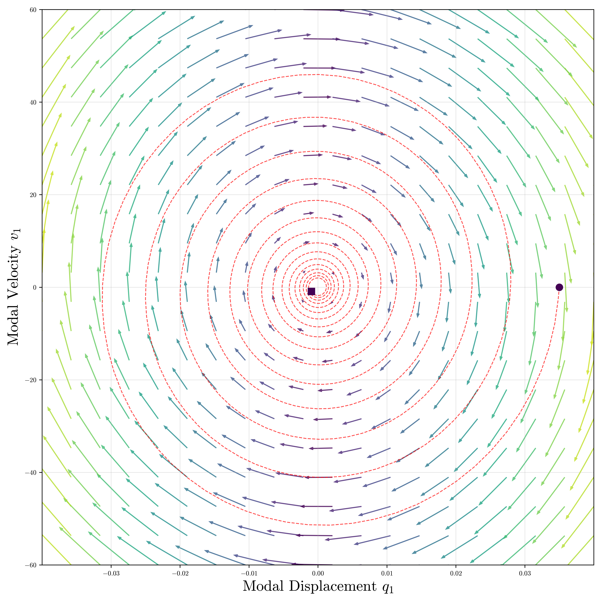
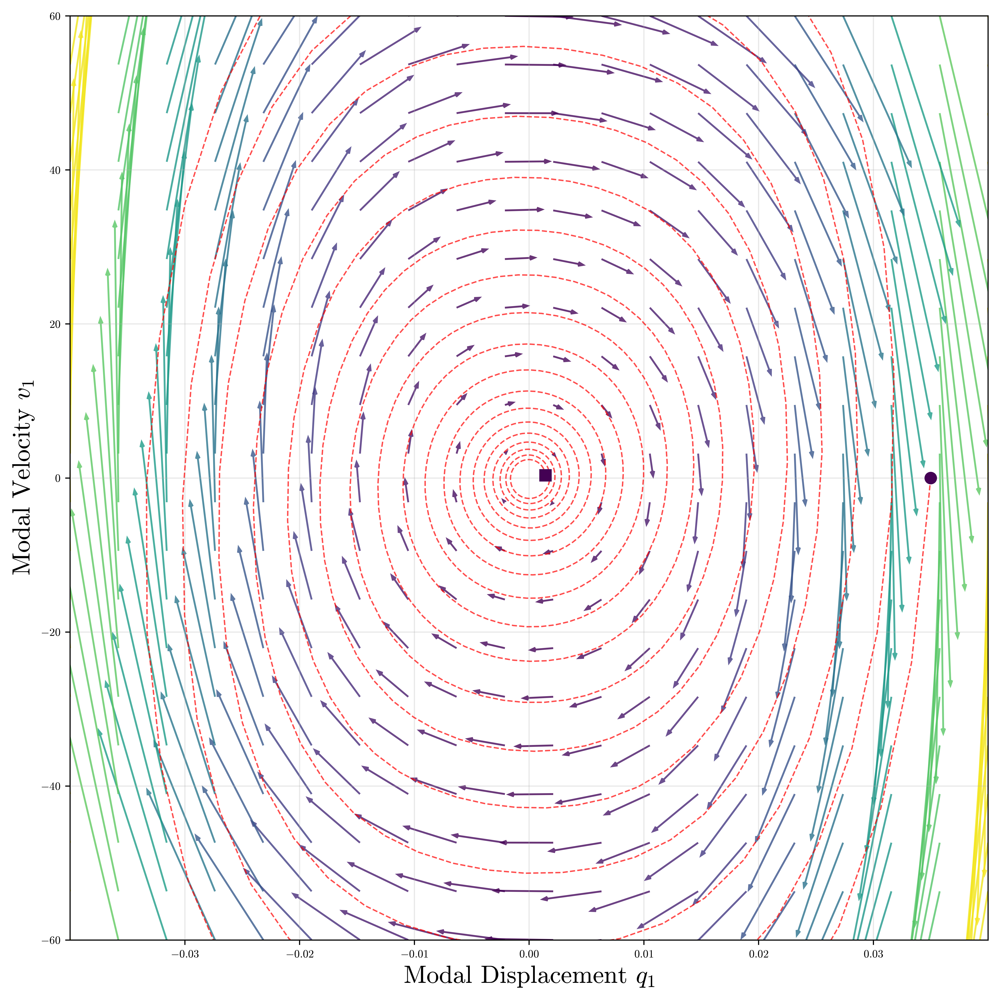
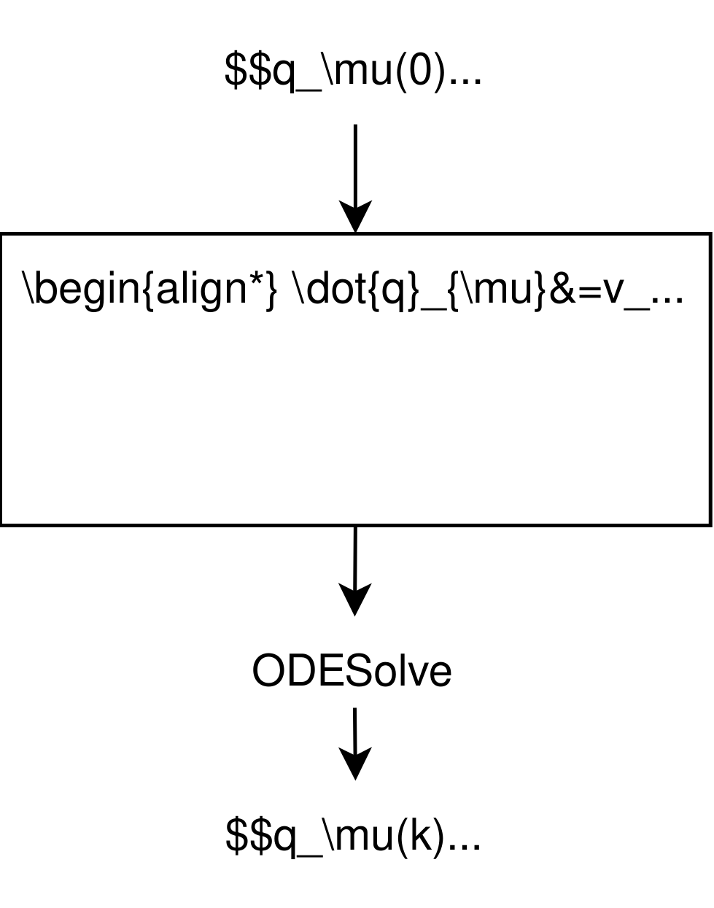
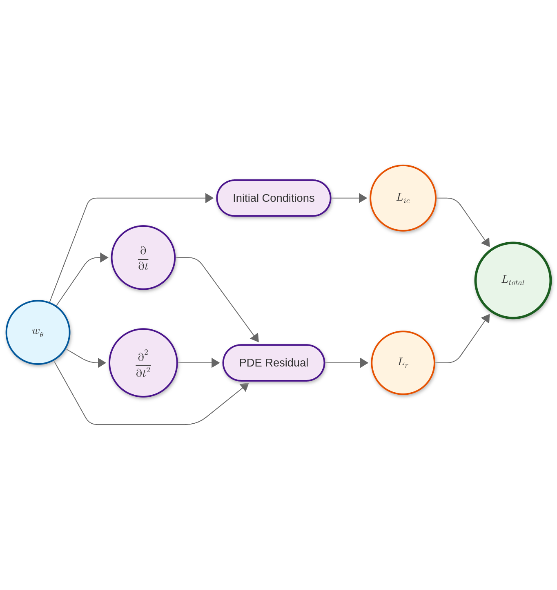
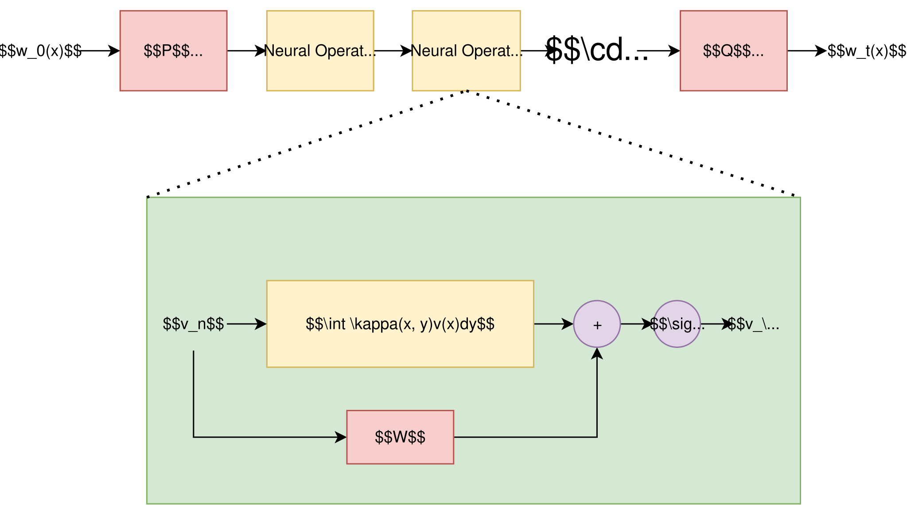
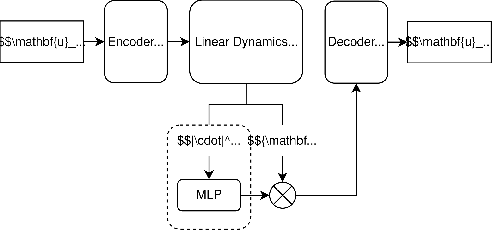

## Why neural networks?

**Traditional Physical modelling:**

- **Pros:**
  - High realism, intuitive parameter control (e.g., pluck position, tension).
- **Cons:**
  - Computationally expensive (often requires solving PDEs at audio rates).
  - Deriving model equations is a domain-specific, expert-driven task.
  - Difficult to calibrate parameters from real-world audio.

**The Neural Promise:**

- Can we learn the physics of sound directly from data?
- Can we create models that are both efficient at inference and physically plausible?
- Can we combine the strengths of data-driven learning and physics-based priors?

## A Spectrum of Physical Priors

Neural models for physical systems can be organized by how strongly they incorporate physical knowledge.

<!-- **More Physics-Driven** \<-\> **More Data-Driven** -->

| **PINNs** | **Neural ODEs** | **Neural Operators** | **Deep Koopman** | **Deep State Space Models** |
| :--- | :--- | :--- | :--- | :--- |
| Embeds the PDE into the loss function. [@raissi_physicsinformed_2019] | Learns the system's vector field. Continuous-time dynamics. [@chen_neural_2018] | Learns the PDE's solution operator. Maps functions to functions. [@kovachki_neural_2023]  | Learns a linear representation of the dynamics in an observable space. [@lusch_deep_2018] | Highly structured recurrent models, often with principled initialization. [@gu_efficiently_2022] |

## Tutorial Roadmap

1. **Neural Ordinary Differential Equations (NODEs):** Learning Continuous-Time Dynamics.
2. **Physics-Informed Neural Networks (PINNs):** Embedding Physics in the Loss.
3. **Neural Operators:** Learning Mappings Between Function Spaces.
4. **Deep Koopman Operator:** Finding Linear Representations for Non-Linear Systems.
5. **Deep State Space Models (DSSMs):** Structured Sequence Models for Audio.
6. **Conclusion:** Comparative Analysis & Future Directions.

## Neural ODEs

:::::: {.columns}
::: {.column}
A Neural ODE (NODE) defines the continuous evolution of a state $w(t)$ by parameterizing its time derivative with a neural network $f_\theta$:

$$\frac{d w(t)}{d t} = f_\theta(w(t), t)$$

The network **learns the vector field (the dynamics)**, not the solution trajectory itself. The final state is found by integrating this equation using a numerical ODE solver. [@kidger_neural_2022]
:::
::: {.column}
<!-- {width=60% fig-align="center"} -->
{width=90% fig-align="center"}
:::
::::::

## NODEs: How

:::: {.columns}

::: {.column}

{width="400" height="400" data-id="box1" auto-animate-delay="0"}

:::

::: {.column style="font-size: 70%;"}

<!-- - The neural network $f_\theta$ is called repeatedly by the solver to get the derivative at any point $(w, t)$. -->
- **Training:** Gradients are propagated back through the solver's operations, either by BPTT (discretise-optimise) or using the adjoint sensitivity method (optimise-discretise[@chen_neural_2018].

- **Adaptive Solvers:** They can leverage a vast collection of ODE solvers, some of which can take larger steps when dynamics are simple and smaller steps when they are complex, ensuring numerical stability.

- **Hybrid modelling:** We can combine known physics with learned components, optimising physical parameters and nueral networks.
  $$\frac{d w(t)}{d t} = {F_{\text{physics}}(w(t))} + {f_{\theta}(w(t))}$$
:::

::::

## Example: Stormer-Verlet

## Example: Stormer-Verlet video

## NODEs: Challenges & Summary

**Challenges:**

- **Computational Cost:** Training can be slow.
- **Numerical Stability & Accuracy:** The choice of ODE solver and its tolerance settings can significantly impact stability and accuracy.

**Summary:**

- NODEs optimise continuous parameters and use a discretisation based on well-known numerical schemes.
- Hybrid models that fuse known physics with learned dynamics.

# Physics-Informed Neural Networks

# Physics-Informed ~~Neural Networks~~ losses

## PINNs

Physics-Informed Neural Networks (PINNs) take a more direct approach: embed the physical law itself into the learning objective[@raissi_physicsinformed_2019].

The network $\hat{w}(x, t; \theta)$ directly approximates the solution to a PDE. The loss function forces the network's output to satisfy two things:

1. **Data Fidelity:** Match observed data points (initial/boundary conditions).
2. **Physics Fidelity:** Obey the governing PDE at all points in the domain.

The *physics* part of the loss is the **PDE residual**:
$$
\mathcal{L}_{\text{physics}} = || \mathcal{N} w_\theta - f ||^2_{\Omega}
$$
where $\mathcal{N}$ is the differential operator (e.g., $\frac{\partial^2}{\partial t^2} - c^2 \frac{\partial^2}{\partial x^2}$).

## How PINNs Work & Why They Matter for Audio

::: {.columns}

::: {.column width="50%"}
- **Strong Priors:** Good for data-sparse problems, as the PDE regularizes the solution space heavily.
- **Inverse Problems:** Can solve for unknown PDE parameters (e.g., stiffness, damping).
:::

::: {.column width="50%"}
{width="100%" style="clip-path: inset(20% 0 20% 0);"}
:::

:::

<!--  -->

## For the damped harmonic oscillator

$$\mathcal{N}^i = \left( \frac{d^2}{dt^2} + 2 \gamma \frac{d}{dt} + \omega^2 \right) q_\theta(t_r^i)$$

$$
\begin{aligned}
\mathcal{L}_{ic, q}(\theta) &= \left|q_\theta(0) - q_0\right|^2 \\
\mathcal{L}_{ic, v}(\theta) &= \left|\frac{d q_\theta}{d t}(0) - v_0\right|^2 \\
\mathcal{L}_{r}(\theta) &= \frac{1}{N_r} \sum_{i=1}^{N_r}\left|\mathcal{N}^i \right|^2 \\
\\ \hline
\mathcal{L}(\theta) &= \lambda_{ic,1}\mathcal{L}_{ic, q}(\theta) + \lambda_{ic,2}\mathcal{L}_{ic, v}(\theta) + \lambda_r\mathcal{L}_{r}(\theta)
\end{aligned}
$$

## For the string or membrane

$$\mathcal{N}^i = \left( \rho \frac{\partial^2}{\partial{t^2}} + d_1 \frac{\partial}{\partial{t}} - T_0 \frac{\partial^2}{\partial{x^2}} \right) w_\theta(t_r^i, x_r^i)$$

$$
\begin{aligned}
\mathcal{L}_{ic, w}(\theta) &= \frac{1}{N_{ic1}} \sum_{i=1}^{N_{ic1}}\left|w_\theta\left(0, x_{ic}^i\right)-g_1\left(x_{ic}^i\right)\right|^2 \\
\mathcal{L}_{ic, v}(\theta) &= \frac{1}{N_{ic2}} \sum_{i=1}^{N_{ic2}}\left|\frac{\partial w_\theta}{\partial t}\left(0, x_{ic}^i\right)-g_2\left(x_{ic}^i\right)\right|^2 \\
\mathcal{L}_{bc}(\theta) &= \frac{1}{N_{bc}} \sum_{i=1}^{N_{bc}}\left( \left|w_\theta\left(t_{bc}^i, 0\right)\right|^2 + \left|w_\theta\left(t_{bc}^i, L\right)\right|^2 \right) \\
\mathcal{L}_{r}(\theta) &= \frac{1}{N_r} \sum_{i=1}^{N_r}\left|\mathcal{N}^i - f^i \right|^2 \\
\\ \hline
\mathcal{L}(\theta) &= \lambda_{ic,1}\mathcal{L}_{ic, w}(\theta) + \lambda_{ic,2}\mathcal{L}_{ic, v}(\theta) + \lambda_{bc}\mathcal{L}_{bc}(\theta) + \lambda_r\mathcal{L}_{r}(\theta)
\end{aligned}
$$

## PINNs: Challenges & Summary

- **Core Idea**: Embeds the governing PDE directly into the network's loss function using automatic differentiation.
- **Application:** Powerful for enforcing physical constraints and solving inverse problems, especially in **data-limited** high-dimensional scenarios[@olivieri_physicsinformed_2024].
- **Challenge:** Training is notoriously difficult [@rathore_challenges_2024] due to complex optimization landscapes, often requiring custom strategies [@wang_experts_2023], compared to other approaches they fall short [@mcgreivy_weak_2024].

# Neural Operators

## Neural Operators

For time-dependent problems, Neural Operators learn the **operator** that maps initial conditions and forcing terms directly to the solution at a future time.

Given a time-dependent PDE with an initial state $w_0(x)$ and a forcing function $f(x, t)$:

$$
\frac{\partial w}{\partial t} = \mathcal{N}(w, a, \dots) + f(x,t)
$$

The goal is to learn the operator $\mathcal{G}_\theta$ that propagates the initial state to a final time $T$, conditioned on the forcing history.

The neural operator learns an approximation of this entire evolution:
$$
w(\cdot, T) \approx \mathcal{G}_\theta(w_0, f)
$$

##

## Neural Operators: Fourier kernel

$$
\begin{aligned}
w(x) &= \int_{\Omega} \kappa(x, y) w_0(y) \mathrm{d} y \\
u(x) &= (\kappa * v)(x)
\end{aligned}
$$

using the convolution theorem, we have:

$$
\mathcal{F}(w) = \mathcal{F}(\kappa) \cdot \mathcal{F}(w_0) \quad \implies \quad w(x) = \mathcal{F}^{-1}(\mathcal{F}(\kappa) \cdot \mathcal{F}(w_0))(x)
$$

The Fourier Neural Operator approximates this by replacing the transform of the kernel with learnable weights 

$$
w(x) \approx \mathcal{F}^{-1}(\mathcal{R}_{\theta} \cdot \mathcal{F}(v))(x)
$$

where we optimise the (typically truncated) complex weights $\mathcal{R}_{\theta}$ during training.

## Neural Operators: an interpretation

For linear PDEs, the operator can be interpreted as a modal method[@parker_physical_2022]:

$$
w(x, t) \approx \mathcal{T}^{-1}(e^{\mathcal{\Lambda}t} \cdot \mathcal{T}(w_0))(x)
$$

where the forward and inverse transforms are defined as follows:

$$
\begin{aligned} \mathcal{T}\{w(x,t)\} &= \int_{V}\tilde{K}_{\mu}^{H}(x)w(x,t)dx && \text{(Forward Projection)} \\
\mathcal{T}^{-1}\{q_{\mu}(t)\} &= \sum_{\mu=0}^{\infty}\frac{{q}_{\mu}(t)K_{\mu}(x)}{||K_{\mu}||} && \text{(Back-Projection)} \end{aligned}
$$

- $K_\mu$ are the eigenfunctions of the spatial operator
- $\Lambda$ is a diagonal matrix of the corresponding eigenvalues

## Example

## **Neural Operators: Summary & Challenges**

A concise summary of Neural Operators, their applications in audio, and their main challenges.

* **Core Idea:** Learns the solution **operator** of a PDE, often implemented efficiently as a **Fourier Neural Operator (FNO)** which operates in the frequency domain.
* **Application:** It can be used to model the dynamics of vibrating systems (e.g., strings, membranes) for sound synthesis [@parker_physical_2022],[@middleton_application_2023].
* **Primary Challenge:** Models can be computationally complex and require large datasets, performance is sensitive to architectural choices like the kernel design. Not really efficient in sample per sample processing.

# Deep Koopman Networks

## Linearizing the Non-Linear

![From [@brunton_datadriven_2022]](figures/brunton_koopman.png){style="display: block; margin: 0 auto;"} 

**The Koopman Idea:** Instead of analyzing the system in its native *state space*, lift it to a different, possibly infinite-dimensional *observable space*, where the dynamics become **linear**. The **Koopman Operator** $K$ is the linear operator that evolves the observables forward in time
$$g(\mathbf{x}_{k+1}) = (Kg)(\mathbf{x}_k)$$

## Deep Koopman Networks (DKNs)

How do we find the observable functions $g$? The space of all possible observables is infinite-dimensional.

1.  Use a neural network **Encoder** ($\mathbf{\varphi}_\theta$) to learn the mapping from the state space $\mathbf{x}$ to a finite-dimensional latent space of good observables.
2.  In this latent space, the dynamics are constrained to be linear via **soft penalties**, governed by a single matrix $\mathbf{\Lambda}$.
3.  Use a neural network **Decoder** to map from the latent space back to the state space.

$$
\mathbf{\varphi}_\theta (\mathbf{x}_{k+1})  = \mathbf{\Lambda} \mathbf{\varphi}_\theta (\mathbf{x}_{k})
$$

## Example

## Example

## Example:

## **Koopman Analysis as a Generalized Modal Synthesis**

The Koopman framework provides a unifying perspective on linear and non-linear audio synthesis.

### For Linear Systems (e.g., an ideal string)
For a linear vibrating system, Koopman analysis directly corresponds to traditional modal analysis:

  - The Koopman **eigenfunctions** ($\varphi_i$) and **modes** ($\mathbf{v}_i$) are the spatial **vibration modes** of the string.
  - The Koopman **eigenvalues** ($\lambda_i$) represent the **modal frequencies and damping**.

### For Non-Linear Systems
For non-linear systems, we find some parameterization of linear resonators that account for the coupling and pitch glide effects.

## **Deep Koopman Networks: Summary & Challenges**

* **Core Idea:** Uses a neural network to learn a set of "observables" that transform a system's non-linear dynamics into a linear evolution in a latent space.
* **Application:** Generalizes modal synthesis to non-linear systems, making it ideal for modeling important effects like pitch glides.
* **Primary Challenge:** The central difficulty is finding a good set of observables. Modeling systems with state-dependent parameters can also be inefficient for long sequences.

# Deep State Space Models

## Deep State Space Models (DSSMs): The Core Idea

Representation for linear time-invariant (LTI) systems:

$$
\begin{aligned}
\dot{\mathbf{x}}(t) &= \mathbf{A} \mathbf{x}(t) + \mathbf{B} \mathbf{u}(t) \quad & \
\mathbf{y}(t) &= \mathbf{C} \mathbf{x}(t) + \mathbf{D} \mathbf{u}(t) \quad &
\end{aligned}
$$ 

## The Duality of DSSMs: Recurrence and Convolution

1.  **Recurrent Representation:** After discretization, the SSM is a linear RNN. This is very efficient for **auto-regressive inference** (generating one sample at a time).

$$
\begin{aligned}
\mathbf{x}_k &= \bar{\mathbf{A}} \mathbf{x}_{k-1} + \bar{\mathbf{B}} \mathbf{u}_k \\
\mathbf{y}_k &= \bar{\mathbf{C}} \mathbf{x}_k
\end{aligned}
$$

2.  **Convolutional Representation:** Because the system is LTI, its output is the convolution of the input with a fixed **impulse response** (or kernel)

$$
\mathbf{h}_k = \bar{\mathbf{C}} \bar{\mathbf{A}}^k \bar{\mathbf{B}}
$$

This way we can use FFT to apply the convolution efficiently.

## **DSSMs: Structure and Initialization**

A challenge in DSSMs was initializing the state matrices ($\mathbf{A}$, $\mathbf{B}$, $\mathbf{C}$), as random initialization was not ideal. The HiPPO[@gu_hippo_2020] framework provides a principled solution.

* **HiPPO** (High-order Polynomial Projection Operators) is a method used to derive the $\mathbf{A}$ and $\mathbf{B}$ matrices based on a principled theory.
* The core idea is to construct these matrices so that the model's state, $\mathbf{x}(t)$, becomes an optimal, continuously updated projection of the input signal's history onto a polynomial basis.
* This provides the model with a strong, built-in prior for compressing and remembering **long-range dependencies**, which is crucial for modeling signals like audio.

## Deep State Space Models: Summary & Challenges

* **Core Idea:** A sequence model based on a learnable state-space representation that can be viewed as both a recurrent system (for efficient inference) and a convolutional system (for fast, parallel training).
* **Application:** Good at modelling long sequences, making them effective for tasks like unconditional raw audio generation [@goel_its_2022] and physical modelling.
* **Primary Challenge:** Performance is highly sensitive to the initialization of the state matrices. Additionally, the large number of parameters can make them difficult to deploy in real-time audio applications.

## Comparison with the string

{width=60% fig-align="center"}

## Comparative Analysis: Choosing Your Tool

| Method | Core Idea | Prior | Time | Advantage | Challenge |
| :--- | :--- | :--- | :--- | :--- | :--- |
| **Neural ODE** | Learn vector field $dw/dt$ | Weak-Strong | Continuous | Flexible hybrids | Solver cost |
| **PINN** | PDE in loss | Strong | Continuous | Inverse problems | Hard optimization |
| **Neural Operator**| Learn operator | Medium | Agnostic | Discretisation Invariant | Data hungry |
| **Koopman**| Linear in observables | Weak | Discrete | Fast, interpretable* | Find good observables |
| **DSSM** | Learnable SSM | Weak | Discrete | Fast* | Large, black box |
: {.small}

## Resources & Further Reading

**Books:**

  - Kidger, "On Neural Differential Equations," 2022.
  - Brunton & Kutz, "Data-Driven Science and Engineering: Machine Learning, Dynamical Systems, and Control," 2022.

# Thank You & Questions

